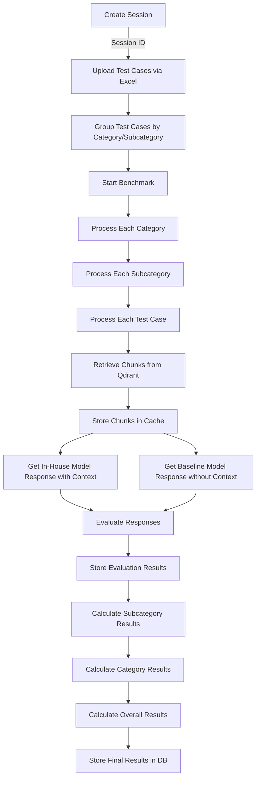

# Benchmarking Service

A microservice for benchmarking in-house AI models against baseline models (like GPT-5) using categorized test cases.

## Features

- Create and manage benchmark sessions
- Create and organize test categories and subcategories
- Upload test cases via Excel
- Retrieve relevant context chunks from Qdrant
- Run benchmarks comparing in-house model with baseline model
- Evaluate model responses and calculate scores
- View results by category, subcategory, and individual test cases

## Architecture

The benchmarking pipeline follows these steps:

1. **Session Creation**: Create a benchmarking session with in-house and baseline model IDs.
2. **Test Case Upload**: Upload test cases via Excel, organized by categories and subcategories.
3. **Context Retrieval**: For each test case, retrieve relevant context chunks from Qdrant.
4. **Caching**: Store retrieved chunks in Redis cache with TTL.
5. **Model Evaluation**: Run each test case through both models (in-house with context, baseline without).
6. **Response Comparison**: Evaluate in-house model responses against baseline responses.
7. **Result Storage**: Store results in the database and emit events for real-time updates.

### Pipeline Flow Diagram



## API Endpoints

The service exposes these microservice message patterns:

### Sessions
- `create_session`: Create a new benchmark session
- `get_session`: Get a session by ID
- `get_sessions`: Get all sessions
- `delete_session`: Delete a session

### Categories
- `create_category`: Create a new category
- `get_categories`: Get all categories
- `create_subcategory`: Create a new subcategory
- `get_subcategories`: Get subcategories by category ID

### Test Cases
- `upload_test_cases`: Upload test cases via Excel
- `get_test_cases_by_session`: Get test cases by session ID
- `get_test_cases_by_subcategory`: Get test cases by subcategory ID

### Benchmarking
- `start_benchmark`: Start a benchmark session

### Evaluations
- `get_evaluations_by_session`: Get evaluations by session ID
- `get_evaluations_by_test_case`: Get evaluations by test case ID
- `get_evaluation_results`: Get aggregated evaluation results

## Environment Variables

The service requires these environment variables:

```
# Database
DB_HOST=localhost
DB_PORT=5432
DB_USERNAME=postgres
DB_PASSWORD=postgres
DB_NAME=benchmarking
DB_SYNC=false

# Redis
REDIS_HOST=localhost
REDIS_PORT=6379
REDIS_PASSWORD=

# Models
ANTHROPIC_API_KEY=your-anthropic-api-key
IN_HOUSE_MODEL_URL=http://localhost:8000/v1/chat/completions
IN_HOUSE_MODEL_API_KEY=your-in-house-model-api-key

# Qdrant
QDRANT_URL=http://localhost:6333

# Service
AGENT_BUS_HOST=0.0.0.0
AGENT_BUS_PORT=3005
```

## Getting Started

1. Install dependencies:
   ```
   npm install
   ```

2. Set up environment variables (create a `.env` file)

3. Start the service:
   ```
   npm run start:dev benchmarking-service
   ```

## Excel Template Format

The Excel file for uploading test cases should have these columns:
- `prompt`: The test case prompt
- `subCategoryId`: ID of the subcategory
- `description` (optional): Description of the test case
- `expectedOutput` (optional): Expected output for the test case
